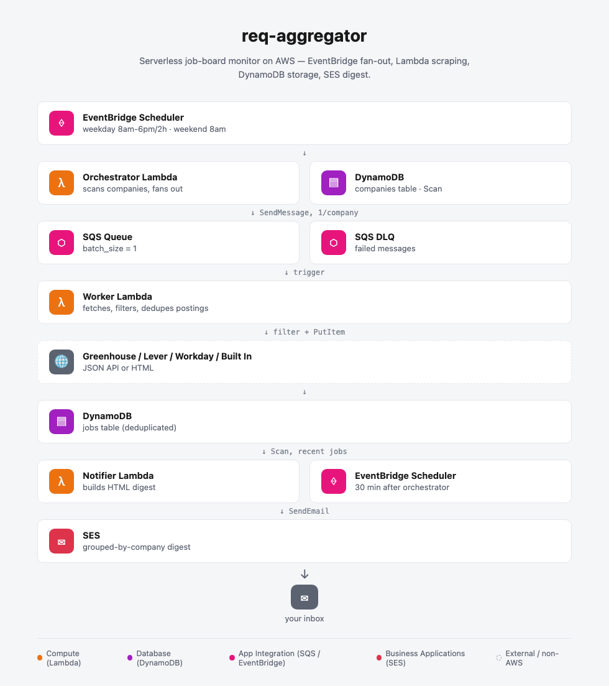
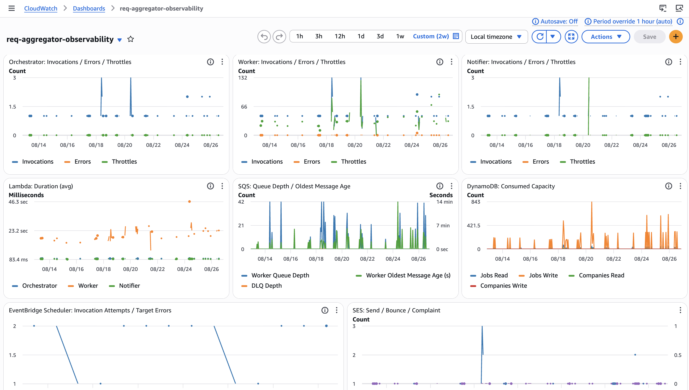

# terraform-aws-req-aggregator

Automated job board monitor. An EventBridge cron fans out one Lambda per company to scrape careers pages, deduplicates results in DynamoDB, and emails a daily digest via SES.

The worker supports five scraping backends:
- **Greenhouse / Lever / Workday** — direct JSON API calls
- **Oracle** — Oracle Fusion Cloud Recruiting's public `recruitingCEJobRequisitions` REST API — the same unauthenticated endpoint the career site's own search page calls
- **Built In** — scrapes a Built In (builtin.com) search results page (server-rendered HTML); since it aggregates postings across many employers, each job carries its own company name and postings from companies already tracked directly elsewhere in `companies.json` are skipped

Beyond ATS-specific scraping, every job is passed through a relevance filter before being written to DynamoDB: it must match a target-role keyword (platform/SRE/DevOps/cloud/infrastructure/staff engineer), must not look like a management role, must not be a non-US posting, and must match a configurable location/work-type preference (defaults to remote-only — see [Configuration](#configuration)). See `worker/handler.py:_filter_relevant_jobs`.

Clearance filtering is tiered, not a blanket cutoff: Public Trust, Secret, and Top Secret are each independently allow/deny-able (`allow_public_trust`/`allow_secret_clearance`/`allow_top_secret_clearance`), and a posting with an unspecified/ambiguous clearance mention is never dropped outright — it's kept and flagged for manual review in the notifier digest instead. See `worker/handler.py:_clearance_decision`.

## Architecture

<picture>
  <source media="(prefers-color-scheme: dark)" srcset="docs/architecture-dark.png">
  
</picture>

## Observability



A CloudWatch dashboard (`main.tf`) tracks the pipeline end-to-end using only standard AWS-published metrics for Lambda, SQS, DynamoDB, EventBridge Scheduler, and SES, plus three CloudWatch Logs Insights widgets against the existing structured (Powertools JSON) logs — recent errors/warnings, jobs written per day, and ATS/backend fetch warnings (e.g. a company whose `ats` value doesn't match a supported backend). No custom metrics are emitted, so it stays within CloudWatch's free tier.

## Usage

This repo is a standalone Terraform module (repo root = module root) — Lambda source and infrastructure together, with no backend or provider configuration of its own, so it drops straight into a consuming root configuration:

```hcl
module "req_aggregator" {
  source = "github.com/ccliver/terraform-aws-req-aggregator"

  prefix           = "req-aggregator"
  ses_from_address = "you@yourdomain.com"
  ses_to_address   = "you@yourdomain.com"
  # ... see examples/complete/main.tf for every available variable
}
```

See [`examples/complete/`](examples/complete/) for a fully commented example setting every variable, and the [Configuration](#configuration) table below for a quick reference. Whatever runs `terraform apply` against this module needs `bash`, `pip3`/`python3.13`, `zip`, and `openssl` on `PATH` — Lambda packages are built automatically as part of `plan`/`apply` (see `scripts/build-lambda-package.sh`), no separate build step required.

## DynamoDB Tables

### `req-aggregator-companies`
| Attribute    | Type | Role          |
|-------------|------|---------------|
| company_name | S    | Partition key |
| careers_url  | S    | Careers page URL |
| ats          | S    | ATS backend (`greenhouse`, `lever`, `workday`, `oracle`, or `builtin`) |

### `req-aggregator-jobs`
| Attribute     | Type | Role          |
|--------------|------|---------------|
| job_id        | S    | Partition key — SHA-256 of `company\|title\|url` |
| company       | S    | Company name |
| title         | S    | Job title |
| url           | S    | Job posting URL |
| location      | S    | Location string |
| discovered_at | S    | ISO-8601 timestamp |

## Local Development

```bash
# Install uv (https://docs.astral.sh/uv/)
curl -LsSf https://astral.sh/uv/install.sh | sh

# Install all workspace packages + dev deps
uv sync --all-packages

# Run tests
uv run pytest

# Lint + format
uv run ruff check src/
uv run ruff format src/

# Type check
uv run ty check src/

# Install pre-commit hooks
uv run pre-commit install
uv run pre-commit install --hook-type pre-push  # for pytest
```

## Seeding Companies

This module doesn't seed the companies table itself — that's a deployment-time concern for whatever root configuration instantiates it (using the `companies_table_name` output with the AWS CLI, a script, or your own tooling). `companies/companies.json` documents the expected shape, and doubles as a small usable starter list. Each entry requires `company_name`, `careers_url`, and `ats` (`greenhouse`, `lever`, `workday`, `oracle`, or `builtin`):

```json
[
  {"company_name": "Acme Corp", "careers_url": "https://boards-api.greenhouse.io/v1/boards/acme/jobs", "ats": "greenhouse"}
]
```

## Configuration

Pass these as module arguments (see the [Inputs](#inputs) section below for the full list — `examples/complete/main.tf` sets every one explicitly). All except `ses_from_address`/`ses_to_address` have defaults.

`location`/`work_type` and `builtin_location`/`builtin_work_type` are deliberately separate: the curated company list often includes companies chosen for proximity to a specific place (e.g. a planned relocation), so a hybrid/on-site preference there shouldn't share Built In's broad-discovery "remote only" default. A job passes if it matches *either* the configured location *or* the work type (not both) — e.g. with `location = "Reston, VA"` and `work_type = "remote"`, both a Reston-based posting and a fully-remote posting anywhere would pass.

The three `allow_*` clearance variables are each independent — an unspecified/ambiguous clearance mention (no level stated) is never dropped by any of them; it's kept and flagged for manual review in the notifier digest instead, unless every tier is already allowed. See `worker/handler.py:_clearance_decision`.

## CI

Pull requests run two jobs: **pre-commit** (ruff, ty, terraform fmt/validate/docs/tflint/checkov) and **Tests** (pytest). All must pass before merge.

<!-- BEGIN_TF_DOCS -->
## Requirements

| Name | Version |
| ---- | ------- |
| <a name="requirement_terraform"></a> [terraform](#requirement\_terraform) | >= 1.9 |
| <a name="requirement_aws"></a> [aws](#requirement\_aws) | ~> 6.0 |
| <a name="requirement_external"></a> [external](#requirement\_external) | ~> 2.3 |

## Providers

| Name | Version |
| ---- | ------- |
| <a name="provider_aws"></a> [aws](#provider\_aws) | ~> 6.0 |
| <a name="provider_external"></a> [external](#provider\_external) | ~> 2.3 |

## Modules

| Name | Source | Version |
| ---- | ------ | ------- |
| <a name="module_cost_widget"></a> [cost\_widget](#module\_cost\_widget) | ccliver/cw-cost-widget/aws | ~> 1.4 |

## Resources

| Name | Type |
| ---- | ---- |
| [aws_cloudwatch_dashboard.observability](https://registry.terraform.io/providers/hashicorp/aws/latest/docs/resources/cloudwatch_dashboard) | resource |
| [aws_cloudwatch_log_group.notifier](https://registry.terraform.io/providers/hashicorp/aws/latest/docs/resources/cloudwatch_log_group) | resource |
| [aws_cloudwatch_log_group.orchestrator](https://registry.terraform.io/providers/hashicorp/aws/latest/docs/resources/cloudwatch_log_group) | resource |
| [aws_cloudwatch_log_group.worker](https://registry.terraform.io/providers/hashicorp/aws/latest/docs/resources/cloudwatch_log_group) | resource |
| [aws_dynamodb_table.companies](https://registry.terraform.io/providers/hashicorp/aws/latest/docs/resources/dynamodb_table) | resource |
| [aws_dynamodb_table.jobs](https://registry.terraform.io/providers/hashicorp/aws/latest/docs/resources/dynamodb_table) | resource |
| [aws_iam_role.notifier](https://registry.terraform.io/providers/hashicorp/aws/latest/docs/resources/iam_role) | resource |
| [aws_iam_role.orchestrator](https://registry.terraform.io/providers/hashicorp/aws/latest/docs/resources/iam_role) | resource |
| [aws_iam_role.scheduler](https://registry.terraform.io/providers/hashicorp/aws/latest/docs/resources/iam_role) | resource |
| [aws_iam_role.worker](https://registry.terraform.io/providers/hashicorp/aws/latest/docs/resources/iam_role) | resource |
| [aws_iam_role_policy.notifier](https://registry.terraform.io/providers/hashicorp/aws/latest/docs/resources/iam_role_policy) | resource |
| [aws_iam_role_policy.orchestrator](https://registry.terraform.io/providers/hashicorp/aws/latest/docs/resources/iam_role_policy) | resource |
| [aws_iam_role_policy.scheduler](https://registry.terraform.io/providers/hashicorp/aws/latest/docs/resources/iam_role_policy) | resource |
| [aws_iam_role_policy.worker](https://registry.terraform.io/providers/hashicorp/aws/latest/docs/resources/iam_role_policy) | resource |
| [aws_lambda_event_source_mapping.worker_sqs](https://registry.terraform.io/providers/hashicorp/aws/latest/docs/resources/lambda_event_source_mapping) | resource |
| [aws_lambda_function.notifier](https://registry.terraform.io/providers/hashicorp/aws/latest/docs/resources/lambda_function) | resource |
| [aws_lambda_function.orchestrator](https://registry.terraform.io/providers/hashicorp/aws/latest/docs/resources/lambda_function) | resource |
| [aws_lambda_function.worker](https://registry.terraform.io/providers/hashicorp/aws/latest/docs/resources/lambda_function) | resource |
| [aws_lambda_permission.cost_widget_dashboard](https://registry.terraform.io/providers/hashicorp/aws/latest/docs/resources/lambda_permission) | resource |
| [aws_scheduler_schedule.notifier_weekday](https://registry.terraform.io/providers/hashicorp/aws/latest/docs/resources/scheduler_schedule) | resource |
| [aws_scheduler_schedule.notifier_weekend](https://registry.terraform.io/providers/hashicorp/aws/latest/docs/resources/scheduler_schedule) | resource |
| [aws_scheduler_schedule.orchestrator_weekday](https://registry.terraform.io/providers/hashicorp/aws/latest/docs/resources/scheduler_schedule) | resource |
| [aws_scheduler_schedule.orchestrator_weekend](https://registry.terraform.io/providers/hashicorp/aws/latest/docs/resources/scheduler_schedule) | resource |
| [aws_sqs_queue.worker](https://registry.terraform.io/providers/hashicorp/aws/latest/docs/resources/sqs_queue) | resource |
| [aws_sqs_queue.worker_dlq](https://registry.terraform.io/providers/hashicorp/aws/latest/docs/resources/sqs_queue) | resource |
| [aws_sqs_queue_policy.worker](https://registry.terraform.io/providers/hashicorp/aws/latest/docs/resources/sqs_queue_policy) | resource |
| [aws_caller_identity.current](https://registry.terraform.io/providers/hashicorp/aws/latest/docs/data-sources/caller_identity) | data source |
| [aws_iam_policy_document.lambda_assume_role](https://registry.terraform.io/providers/hashicorp/aws/latest/docs/data-sources/iam_policy_document) | data source |
| [aws_iam_policy_document.scheduler_assume_role](https://registry.terraform.io/providers/hashicorp/aws/latest/docs/data-sources/iam_policy_document) | data source |
| [external_external.lambda_build](https://registry.terraform.io/providers/hashicorp/external/latest/docs/data-sources/external) | data source |

## Inputs

| Name | Description | Type | Default | Required |
| ---- | ----------- | ---- | ------- | :------: |
| <a name="input_allow_public_trust"></a> [allow\_public\_trust](#input\_allow\_public\_trust) | Whether to keep job postings that require a Public Trust clearance | `bool` | `true` | no |
| <a name="input_allow_secret_clearance"></a> [allow\_secret\_clearance](#input\_allow\_secret\_clearance) | Whether to keep job postings that require a Secret-tier clearance (Secret, DoD Secret, Interim Secret, or the DOE-equivalent L clearance) — no polygraph or friends/family interviews required | `bool` | `false` | no |
| <a name="input_allow_top_secret_clearance"></a> [allow\_top\_secret\_clearance](#input\_allow\_top\_secret\_clearance) | Whether to keep job postings that require a Top-Secret-tier or above clearance (Top Secret, TS/SCI, a polygraph, a Special Access Program, or the DOE-equivalent Q clearance) | `bool` | `false` | no |
| <a name="input_aws_region"></a> [aws\_region](#input\_aws\_region) | AWS region to deploy resources into | `string` | `"us-east-1"` | no |
| <a name="input_builtin_location"></a> [builtin\_location](#input\_builtin\_location) | Location substring to additionally keep for the Built In (builtin.com) ATS backend; blank disables it (remote-only) | `string` | `""` | no |
| <a name="input_builtin_work_type"></a> [builtin\_work\_type](#input\_builtin\_work\_type) | Work-type keyword to keep for the Built In ATS backend (remote, hybrid, office, any, or any literal substring) | `string` | `"remote"` | no |
| <a name="input_cost_allocation_tag_key"></a> [cost\_allocation\_tag\_key](#input\_cost\_allocation\_tag\_key) | Cost allocation tag key the cost widget filters AWS Cost Explorer by. Must match a tag key actually applied to this module's billed resources (e.g. via default\_tags in the calling provider block) and activated as a Cost Allocation Tag in AWS Billing. Only used when enable\_cost\_widget is true. | `string` | `"Project"` | no |
| <a name="input_cost_allocation_tag_values"></a> [cost\_allocation\_tag\_values](#input\_cost\_allocation\_tag\_values) | Cost allocation tag values to filter Cost Explorer by. Defaults to [var.prefix] when null, matching the common default\_tags pattern of tagging every resource with the module's prefix (e.g. Project = local.prefix). Only used when enable\_cost\_widget is true. | `list(string)` | `null` | no |
| <a name="input_enable_cost_widget"></a> [enable\_cost\_widget](#input\_enable\_cost\_widget) | Whether to add a Cost Explorer widget (via the ccliver/cw-cost-widget/aws module) to the observability dashboard. Defaults to false (unlike enable\_dashboard) because it requires a one-time manual step outside Terraform — activating cost\_allocation\_tag\_key as a Cost Allocation Tag in AWS Billing — and shows no data until that's done and Cost Explorer has accrued cost from activation forward. Has no effect when enable\_dashboard is false. | `bool` | `false` | no |
| <a name="input_enable_dashboard"></a> [enable\_dashboard](#input\_enable\_dashboard) | Whether to create the CloudWatch observability dashboard. It's built entirely from standard AWS-published metrics and Logs Insights queries (no custom metrics), so it costs nothing beyond the free tier when unused — this exists to avoid spending one of the 3 free dashboards/account on it for module users who don't want it | `bool` | `true` | no |
| <a name="input_exclude_title_keywords"></a> [exclude\_title\_keywords](#input\_exclude\_title\_keywords) | Comma-separated title substrings (OR'd together, case-insensitive); a title matching any of these is dropped even if it also matched title\_keywords | `string` | `"manager,director"` | no |
| <a name="input_lambda_memory_mb"></a> [lambda\_memory\_mb](#input\_lambda\_memory\_mb) | Lambda function memory in MB (orchestrator and notifier) | `number` | `512` | no |
| <a name="input_lambda_timeout_seconds"></a> [lambda\_timeout\_seconds](#input\_lambda\_timeout\_seconds) | Lambda function timeout in seconds | `number` | `300` | no |
| <a name="input_location"></a> [location](#input\_location) | Comma-separated location substrings (OR'd together) to additionally keep for every ATS backend except builtin; blank disables it (remote-only). Independent of builtin\_location | `string` | `""` | no |
| <a name="input_log_retention_days"></a> [log\_retention\_days](#input\_log\_retention\_days) | CloudWatch Logs retention in days for the orchestrator, worker, and notifier Lambda log groups | `number` | `30` | no |
| <a name="input_lookback_minutes"></a> [lookback\_minutes](#input\_lookback\_minutes) | Minutes the Notifier looks back when querying for new jobs | `number` | `60` | no |
| <a name="input_notifier_weekday_schedule"></a> [notifier\_weekday\_schedule](#input\_notifier\_weekday\_schedule) | EventBridge cron expression for the Notifier Lambda on weekdays (30 min after orchestrator) | `string` | `"cron(30 9 ? * MON-FRI *)"` | no |
| <a name="input_notifier_weekend_schedule"></a> [notifier\_weekend\_schedule](#input\_notifier\_weekend\_schedule) | EventBridge cron expression for the Notifier Lambda on weekends (30 min after orchestrator). Set to null to disable weekend runs entirely. | `string` | `"cron(30 8 ? * SAT-SUN *)"` | no |
| <a name="input_orchestrator_weekday_schedule"></a> [orchestrator\_weekday\_schedule](#input\_orchestrator\_weekday\_schedule) | EventBridge cron expression for the Orchestrator Lambda on weekdays | `string` | `"cron(0 9 ? * MON-FRI *)"` | no |
| <a name="input_orchestrator_weekend_schedule"></a> [orchestrator\_weekend\_schedule](#input\_orchestrator\_weekend\_schedule) | EventBridge cron expression for the Orchestrator Lambda on weekends. Set to null to disable weekend runs entirely. | `string` | `null` | no |
| <a name="input_prefix"></a> [prefix](#input\_prefix) | Prefix used to name every AWS resource (Lambda functions, DynamoDB tables, SQS queues, etc.), independent of the repo/module name | `string` | `"req-aggregator"` | no |
| <a name="input_schedule_timezone"></a> [schedule\_timezone](#input\_schedule\_timezone) | IANA timezone the schedule cron expressions are evaluated in (EventBridge Scheduler handles DST automatically) | `string` | `"America/New_York"` | no |
| <a name="input_ses_from_address"></a> [ses\_from\_address](#input\_ses\_from\_address) | Verified SES sender email address | `string` | n/a | yes |
| <a name="input_ses_to_address"></a> [ses\_to\_address](#input\_ses\_to\_address) | Recipient email address for job digests | `string` | n/a | yes |
| <a name="input_title_keywords"></a> [title\_keywords](#input\_title\_keywords) | Comma-separated title substrings (OR'd together, case-insensitive) a job title must match at least one of to be kept at all; also drives one paginated Workday/Oracle search per entry | `string` | `"platform,sre,site reliability,devops,cloud engineer,infrastructure,staff engineer"` | no |
| <a name="input_work_type"></a> [work\_type](#input\_work\_type) | Work-type keyword to keep for every ATS backend except builtin (remote, hybrid, office, any, or any literal substring). Independent of builtin\_work\_type | `string` | `"remote"` | no |
| <a name="input_worker_memory_mb"></a> [worker\_memory\_mb](#input\_worker\_memory\_mb) | Worker Lambda memory in MB | `number` | `512` | no |

## Outputs

| Name | Description |
| ---- | ----------- |
| <a name="output_companies_table_name"></a> [companies\_table\_name](#output\_companies\_table\_name) | DynamoDB companies table name |
| <a name="output_cost_widget_lambda_arn"></a> [cost\_widget\_lambda\_arn](#output\_cost\_widget\_lambda\_arn) | ARN of the cost widget Lambda, or null if enable\_cost\_widget/enable\_dashboard is false |
| <a name="output_dashboard_url"></a> [dashboard\_url](#output\_dashboard\_url) | Console URL for the CloudWatch observability dashboard, or null if enable\_dashboard is false |
| <a name="output_jobs_table_name"></a> [jobs\_table\_name](#output\_jobs\_table\_name) | DynamoDB jobs table name |
| <a name="output_notifier_lambda_arn"></a> [notifier\_lambda\_arn](#output\_notifier\_lambda\_arn) | ARN of the Notifier Lambda |
| <a name="output_orchestrator_lambda_arn"></a> [orchestrator\_lambda\_arn](#output\_orchestrator\_lambda\_arn) | ARN of the Orchestrator Lambda |
| <a name="output_worker_dlq_url"></a> [worker\_dlq\_url](#output\_worker\_dlq\_url) | SQS dead-letter queue URL for failed Worker messages |
| <a name="output_worker_function_name"></a> [worker\_function\_name](#output\_worker\_function\_name) | Function name of the Worker Lambda |
| <a name="output_worker_lambda_arn"></a> [worker\_lambda\_arn](#output\_worker\_lambda\_arn) | ARN of the Worker Lambda |
| <a name="output_worker_queue_url"></a> [worker\_queue\_url](#output\_worker\_queue\_url) | SQS queue URL for the Worker Lambda |
<!-- END_TF_DOCS -->
